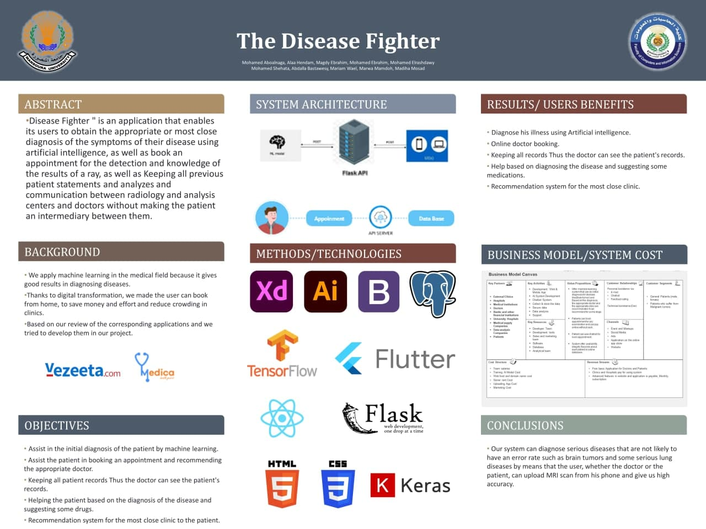

# <b >  The Disease Fighter </b>
 

<b>An Application that enables its users to </b>
 - Obtain the appropriate or most close diagnosis of the symptoms of their disease using AI .
 - <b>Book an appointment</b> for the detection and knowledge of the results of a ray .
 - <b>Keeping </b>all patient records Thus the doctor can see the patient's records .
 - <b>Helping the patient</b> based on the diagnosis of the disease and suggesting some drugs .
 - <b>Recommendation</b> system for the most close clinic to the patient .
- Doctor can provide medical <b>Consulting Online </b>without going to the clinic .

 
 
## <b> Important Links </b>  

- ### <b> Project Promo Video YouTube Link </b> 
    https://youtu.be/qJrBe8SO5uU
    

- ### <b> Application Apk Download Link </b> 
    https://drive.google.com/file/d/183tZlrJGMfcrZMk0ZeRXVJwtLE-Ch3iS/view?usp=sharing
    

- ### <b> Project WebSite Link </b>  
    https://mariam-wael22.github.io/disease-fighter/#/
    

 - ### <b> Project Book Link</b>  
    https://drive.google.com/file/d/16LjadPDw5ycg8snd0VMDFm8_IJklqYiF/view?usp=sharing    
 
 

## Application Features

- Application have two AI Models like Covid-19 and Brain Tumer Model .
- Application produced with two language ( Arabic , English ).
- User can sign up and make his uniq account .
- User can update his picture and crop or edit it to be suitable .
- user can update his information like name , about , phone ......
- user can update his own password .
- Every user can add/update his avatar .
- every user can have his own setting .
- user can contact to app developers if any problem happen .
- Application Divided Into Two Sides 

  - <b> Patient Side </b> :
    - patients can use AI to symptoms of their disease using X-Ray image .
    - patient can book any doctor from any clinic of 13 clinic like ( brain clinic , chest clinic , heart clinic ....) .
    - Patient home have top best 10 rated doctors . 
    - Can see doctor information like his name , image , clinic available dates , rate on our application and previous patient reviews about him .
    - Can call him via his phone number .
    - Can show his booked appointments details .
    - Can delay/delete any appointment .
    - Can show his previous sessions like his diagnose , medicines and files (x-ray images) .
    - Have Favorite List ( can add/delete any doctor to/from it .) .
    - After every session patient deliver notification enables him to rate doctor and write a review about him . 
    - Can Search for any doctor using his name .
    

  - <b> Doctor Side : </b> 

    - Use ML to to symptoms of the disease using X-Ray image .
    - doctor can see his today appointments or all appointments .
    - Can filter to get specific day appointments .
    - have backup for every previous patient session .
    - Can delay any upcoming appointment .
    - Can upload patient session data like his diagnose , medicines and files .

 
 

## Project Framework Repositories 
 - <b>UI / UX</b>   https://github.com/mohamedebrahim4399/api_documention
 - <b>Back End</b>   https://github.com/mohamedebrahim4399/TheDiseaseFighter
- <b>Machine Learning</b>   https://github.com/alaahendam/AI-project
- <b>WebSite</b>   https://github.com/Mariam-wael22/code.git

 
 

## API Documentation

[Basic Data](Documentation/README.md#APIDocumentation)

